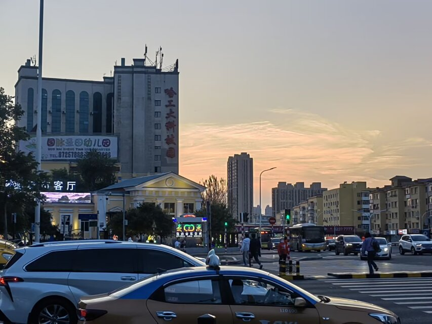

---
category:
  - 代码之外
tag:
  - 随笔
star: 1
---
# 饭后随笔

天气真不错啊，结束了几天阴雨，终于迎来晴天～这两天正是最舒服的时候，出门穿短袖或者长袖都可以，既不会感觉冷，也不会感觉热。

时间过得真快，一转眼，已经来这里快两年了。虽说大学生活还剩两年，可对我来说大概只剩最后的一年了。

明年的现在，我大概已经到企业里面实习了。当我的大多数同龄人还在考研保研，或是提前进组，继续享受大学生活的时候，我已经要变成一名社畜了。这看似是逆流人群的选择，可对于当下的我来说，大概是最好的选择。到那时，是也许寄居在某个大城市的犄角旮旯，每天下班累了就蜗居在狭小昏暗的房间里，过着996且周而复始的生活，努力用时间和生命换取金钱。

不过这并不是一眼望到底的生活。到时候解决了一部分经济问题，我还会回来读研的。也许读完研再回到某个大城市做和原来差不多的工作，又或许继续读博深造，这都说不准。是的，我们都有光明的未来。

现在的我在学校实验室，坐在电脑面前，吹着晚风，享受短暂的休闲时光。不得不说，哈尔滨的夏天是真的很舒服呀～

过几天又要高考了。去年的这时候我还在回忆高中生活，现在的我已经开始留恋大学生活了。

